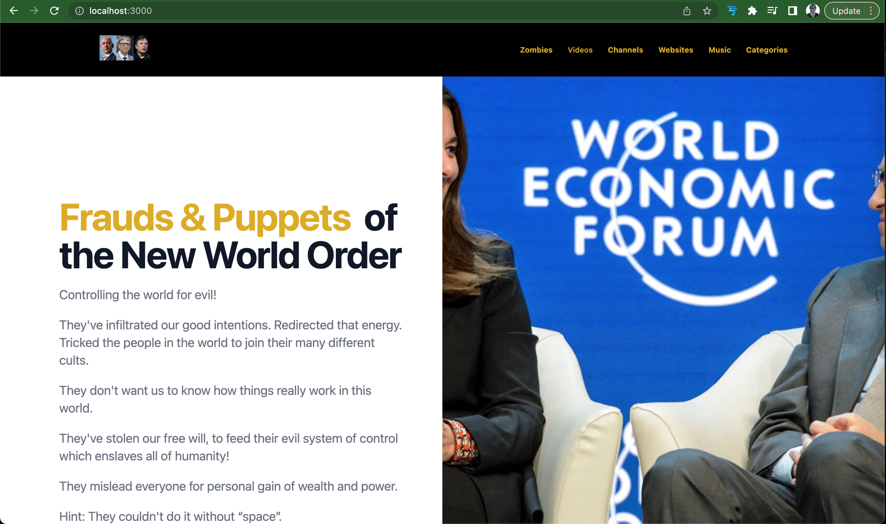
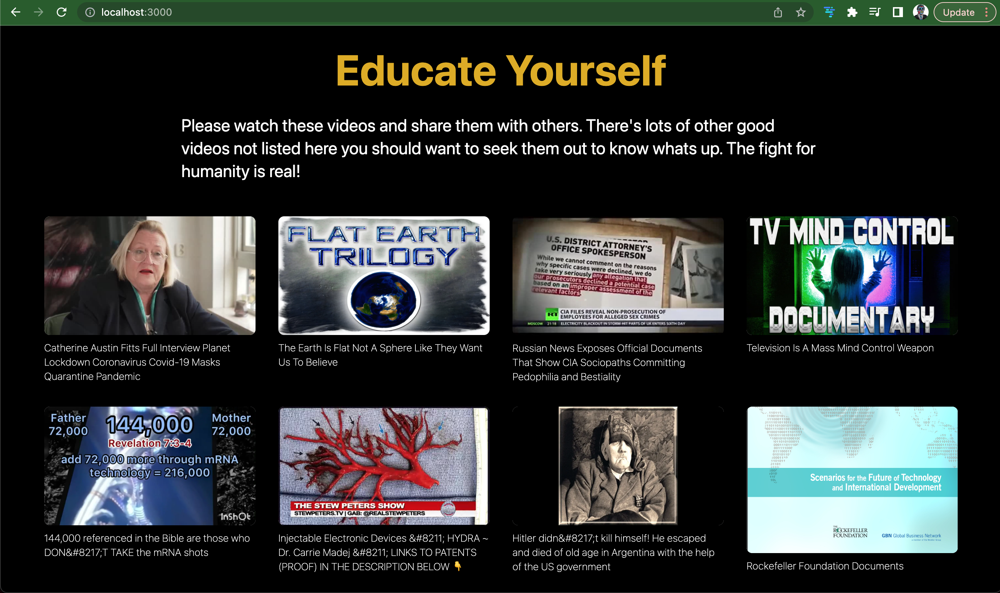
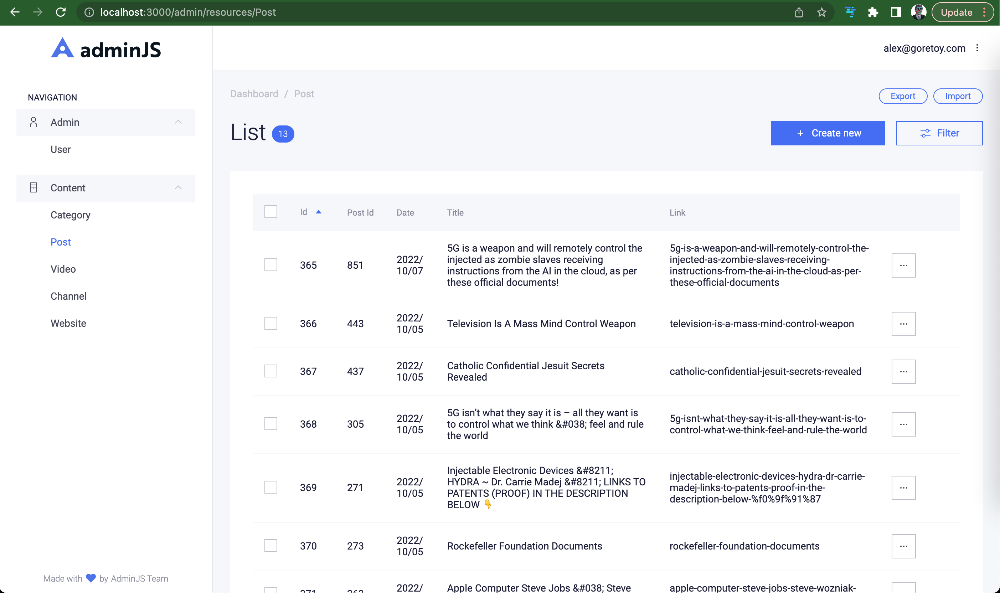

# ZombiesAngularNestjs [https://zombies.cloud](https://zombies.cloud)

### Home page



### Posts page



### Post page


### Videos page


### Video page


### Channels page


### Websites page


### Admin Category


### Admin Channel


### Admin Post



### Admin Video


### Admin Website


[https://stackblitz.com/edit/angular-zombies](https://stackblitz.com/edit/angular-zombies)

#### Install dependencies and run backend development

```shell
cd app && npm install && npm run build
cd api && npm install && npm run build && npx typeorm migration:run -d dist/typeorm-cli.config && npm run start:dev
```

Access https://localhost:3000 to see website, angular app using nestjs api.

Click links on pages to nagivate around the website

Access Admin https://localhost:3000/admin when no users exist any username and password is valid to login until at least one user exists.

Manage users, categories, posts, videos, channels and websites that show up on the website.
